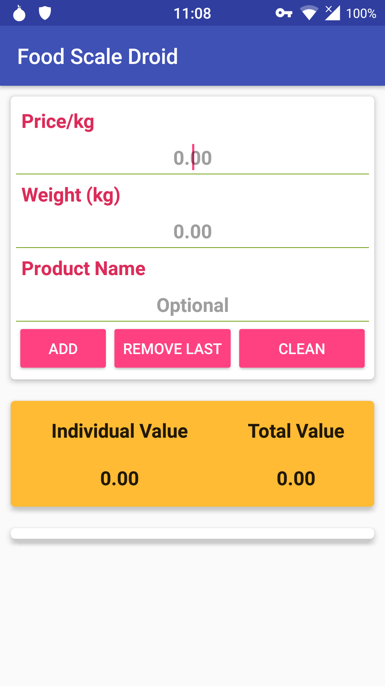
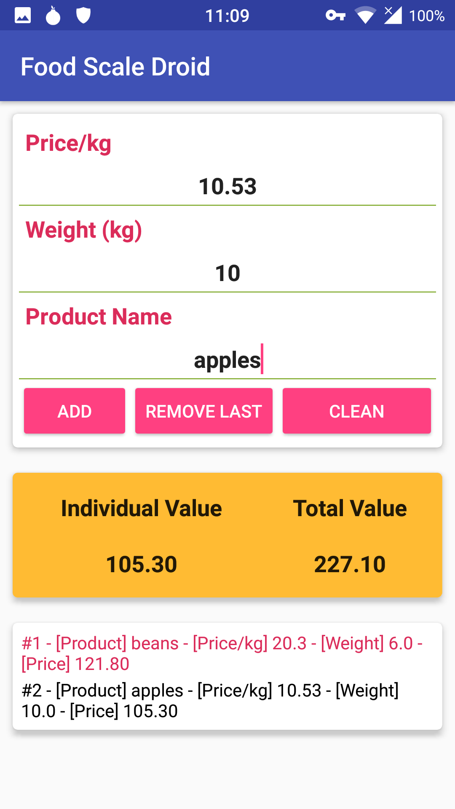

# FoodScaleDroid

#### Basic information

FoodScaleDroid is an Android application to help you to keep track with all the fruits/nuts/vegetables weights/price when you are buying something on a market.

#### What is done

  * Calc the final price based on the kg price and the weight you are taking home
  * Keep a list of the products you are putting on your bag

#### Screenshots

#### Links

#### Contact

For any question, bug report, suggestion please drop us a line

#### Translate

Send us a message

#### The FoodScaleDroid Project Team

##### Special thanks

The icon comes from https://openclipart.org/detail/181397/red-analog-scale (Creative Commons Zero 1.0 Public Domain License)

# License

    Copyright 2015-2016 The Food Scale Project Team

    This program is free software; you can redistribute it and/or
    modify it under the terms of the GNU General Public License
    as published by the Free Software Foundation; either version 3
    of the License, or (at your option) any later version.

    https://www.gnu.org/licenses/gpl-3.0.html

    This program is distributed in the hope that it will be useful,
    but WITHOUT ANY WARRANTY; without even the implied warranty of
    MERCHANTABILITY or FITNESS FOR A PARTICULAR PURPOSE.  See the
    GNU General Public License for more details.
 
    You should have received a copy of the GNU General Public License
    along with this program.  If not, see <http://www.gnu.org/licenses/>.
    
